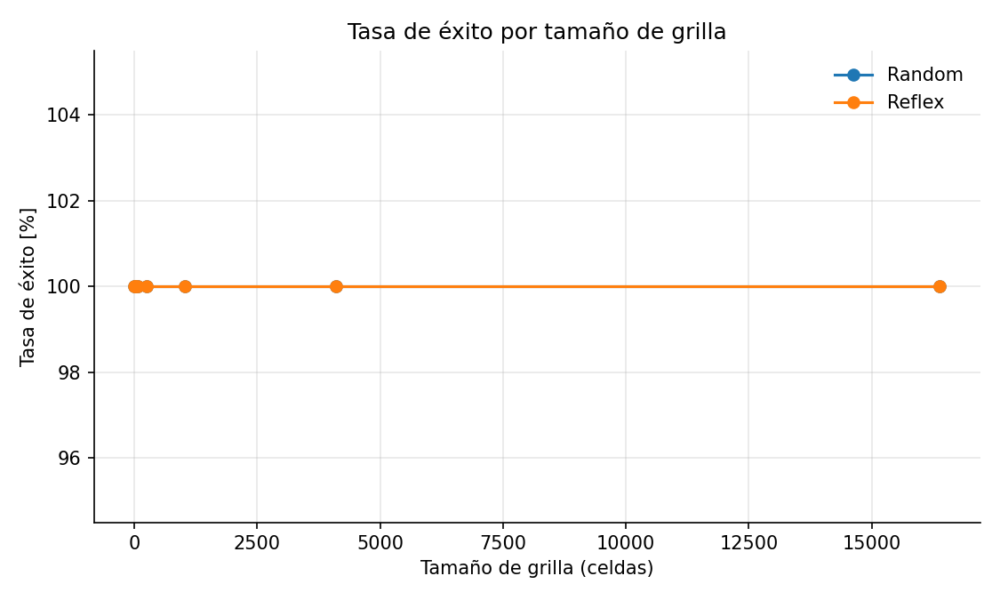

# Reporte de evaluacion de desempeño
Vacuum Cleaner World - comparacion Random vs Reflex
## Descripcion del experimento
- Agentes evaluados: Random y Simple Reflex

## Metricas
- Cobertura
- Acciones = numeros de pasos consumidos por corrida
- Eficiencia = celdas limpiadas por accion
- Tasa de exito
- Tiempo de ejecucion = duracion por corrida

## Resultados
### Rendimiento por tamaño de grilla
- La cobertura cae fuertemente a medida que crece la grilla
- Reflex mantiene sistematicamente mayor  cobertura que Random en casi todos los tamaños
- En grillas grandes ambos agentes logran coberturas bajas, lo que surgiere que el tope de acciones limita la limpieza completa

#### Costo por tamaño de grilla
- Para grillas pequeñas, Reflex suele requerir menos acciones que Random
- A partir de grillas medianas, ambos de apoyan en el tope de 1000 acciones, convergiendo en el mismo costo y volviendo la comparacion sensible a la eficiencia con esa tope
- Con el mismo presupuesto de 1000 acciones, Reflex limpia sensiblemente mas celdas que Random, indicando mejor eficiencia bajo resticcion de pasos
- En corridas con menos acciones, tambien se observa que Reflex tiende a convertir acciones en celdas limpiadas de manera mas favorable
#### Tasa de exito
- La tasa de exito es 100% en ambos agentes a lo largo de los tamaños evaluados, es decir no se registraron fallas de ejecucion
#### Analisis por la tasa de suciedad
- En grillas pequeñas, mayor dirt_rate incrementa la cobertura porque el agente encuentra suciedad con mas facilidad. Reflex se beneficia mas de este efecto
#### Tiempos de ejecucion
- Random presenta mayor tiempo de ejecucion promedio y una dispersion relevante
- Simple Reflex tiende a ejecutar mas rapido, aunque con outliers en escenarios puntuales
## Discusion
### Ventajas de Simple Reflex
- Mejor cobertura que Random para la mayoria de los tamaños de grilla
- Mejor eficiencia bajo retriccione de 1000 accienoes: a igualdad de pasos, limpia mas celdas
- Menores tiempos de ejecucion promedio

### Desventajas de Reflex
- Recorre toda la grilla casi siempre -> en entornos con muy poca suciedad ineficiente

## Reproducibilidad
- Code estaba en una capeta `student_agents` y los resultados se generan en csv en la carpeta `batch_results`
- Generacion de la csv: `python3 -m student_agents.tests_julia_kroepfl`
- Generacion de graficos: `python student_agents/evaluacion.py --csv results_1756153529.csv`(nombre de la csv varia)

## Visualizaciones y análisis complementario

A continuación se incluyen los gráficos generados a partir de los resultados del archivo `results_1756153529.csv`.  
Cada figura resume la relación entre tamaño de grilla, tasa de suciedad (*dirt_rate*) y desempeño de los agentes Random y Simple Reflex.

---

### Figura 1 – Acciones por tasa de suciedad

Este gráfico muestra el número promedio de acciones consumidas por los agentes en función del tamaño de la grilla y la tasa de suciedad.  
Se observa que ambos agentes alcanzan rápidamente el límite de **1000 acciones**, especialmente a partir de grillas medianas, independientemente de la tasa de suciedad.  
Por lo tanto, en entornos grandes la comparación de desempeño debe centrarse en la **eficiencia (celdas limpiadas por acción)**, ya que el costo en acciones se satura.

---

### Figura 2 – Cobertura por tasa de suciedad

La cobertura (porcentaje de celdas limpias) varía con la tasa de suciedad.  
En entornos pequeños, un mayor *dirt_rate* facilita la limpieza porque el agente encuentra más celdas sucias en menos pasos.  
En grillas grandes, la cobertura disminuye notablemente, ya que el agente **no logra completar la limpieza dentro de las 1000 acciones disponibles**.  
El Simple Reflex mantiene consistentemente mejores coberturas que el Random.

---

### Figura 3 – Acciones promedio vs tamaño de grilla

Este gráfico utiliza una tasa de suciedad fija (*dirt_rate = 0.2*) y muestra cómo el costo en acciones crece con el tamaño del entorno.  
A partir de 16×16, ambos agentes agotan el límite de acciones, alcanzando una meseta en 1000 pasos.

---

### Figura 4 – Cobertura vs tamaño de grilla

La cobertura decrece drásticamente con el tamaño de la grilla.  
En escenarios pequeños (2×2, 4×4) ambos agentes pueden limpiar el 100% de la suciedad, pero la **tasa de éxito cae a medida que aumenta el tamaño**, debido al límite de vida de 1000 acciones.  
Esto confirma la observación teórica de que el rendimiento debe disminuir en entornos más amplios.

---

### Figura 5 – Tasa de éxito por tamaño de grilla

La tasa de éxito se mantiene en 100% porque el criterio de éxito considera la finalización de la simulación sin errores, no la limpieza total del entorno.  
En la práctica, la **tasa de cobertura efectiva** es la que refleja la pérdida de rendimiento en entornos grandes.

---

### Figura 6 – Tiempo de ejecución por agente

El tiempo de ejecución medio del agente Reflex es ligeramente mayor debido a su lógica condicional adicional, aunque presenta menos variabilidad que Random.  
Ambos tiempos son consistentes con ejecuciones por debajo de 25 segundos incluso en los entornos más grandes.

---

### Figura 7 – Trade-off: celdas limpiadas vs acciones

Este gráfico muestra la relación entre acciones y celdas limpiadas.  
En la mayoría de las ejecuciones, Reflex convierte mejor cada acción en una celda limpia.  
Para clarificar la tendencia general, sería conveniente mostrar **valores promediados por tamaño de grilla** en lugar de puntos individuales, ya que la dispersión es alta.

---

### Conclusión general

- En grillas pequeñas, ambos agentes pueden alcanzar coberturas completas.  
- En grillas grandes, la cobertura disminuye por la restricción de 1000 acciones.  
- El agente Simple Reflex es sistemáticamente más eficiente, logrando limpiar más celdas con igual presupuesto de acciones.  
- Los resultados empíricos confirman las expectativas teóricas: la **tasa de éxito real (cobertura)** disminuye con el tamaño del entorno, y el desempeño depende tanto del *dirt_rate* como de la capacidad del agente de explotar información del entorno.
