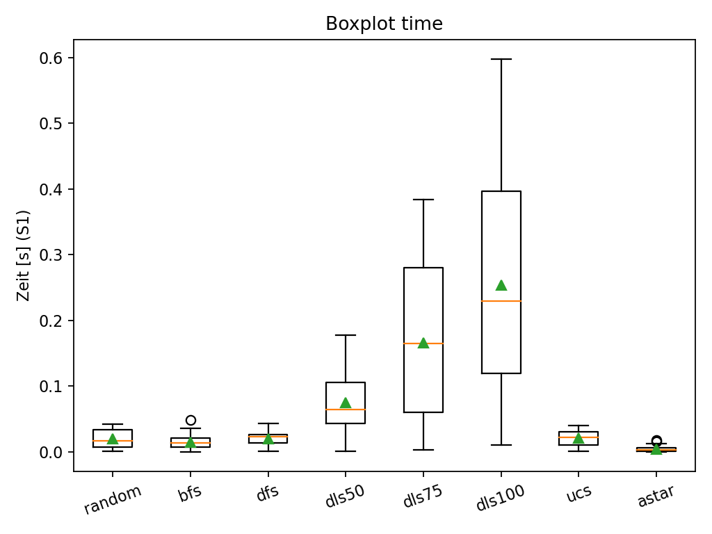
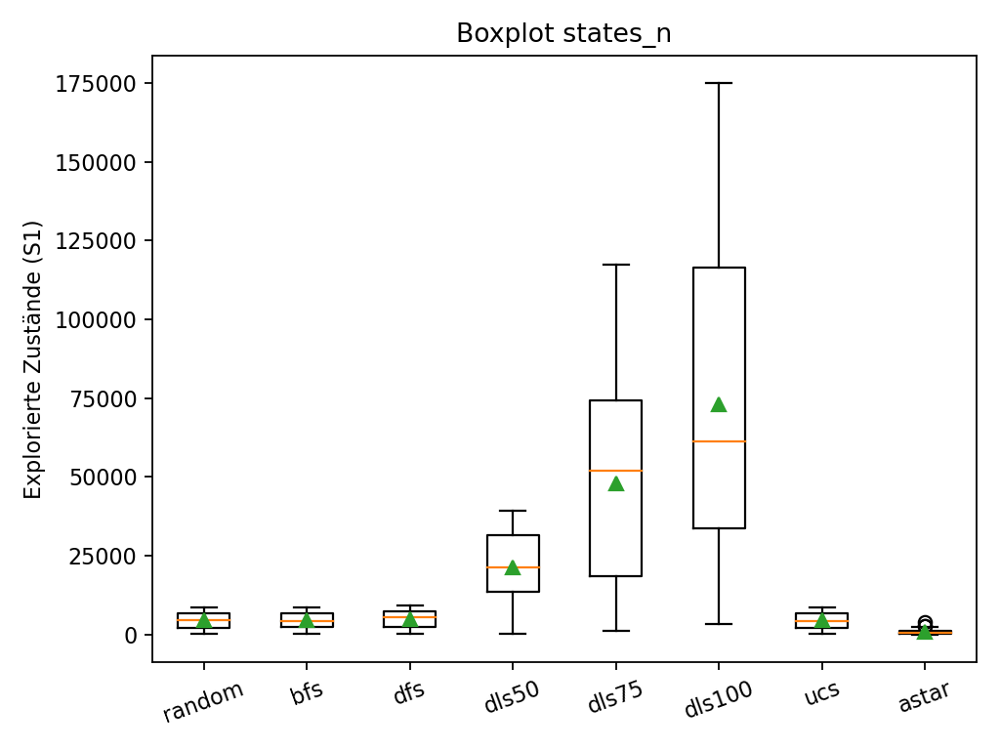
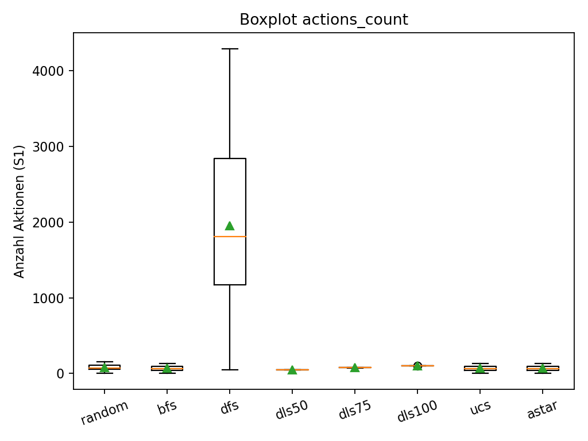
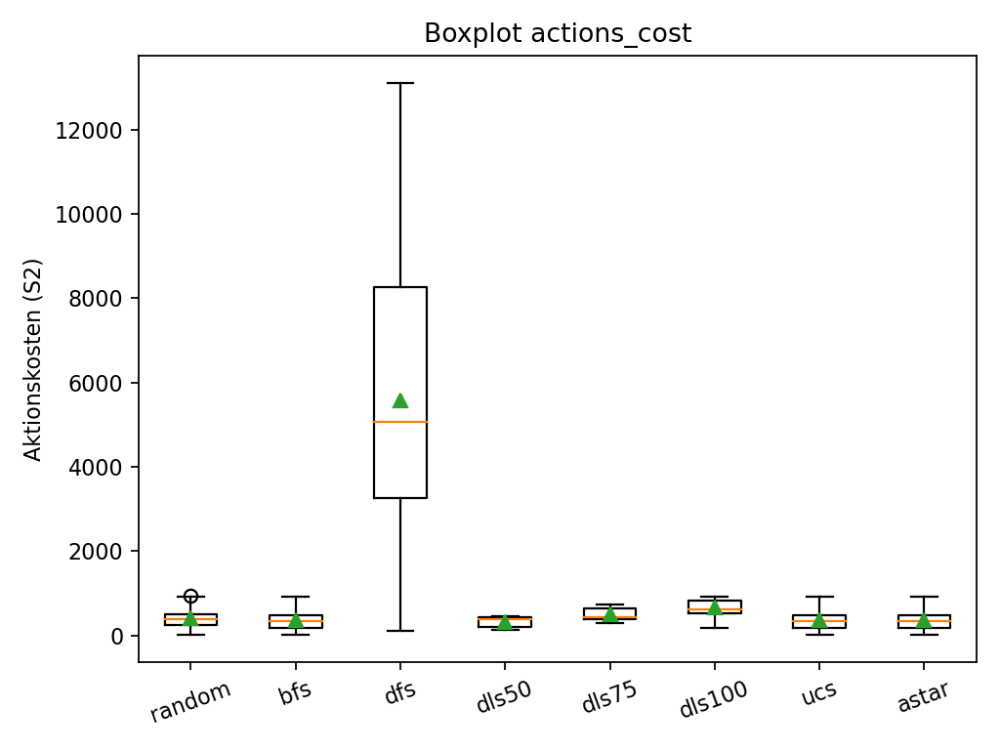

# TP3 – Reporte de Desempeño de Algoritmos

En este reporte se presentan los resultados experimentales de diferentes algoritmos de búsqueda aplicados al escenario **FrozenLake**. El análisis compara métricas de tiempo de ejecución, cantidad de estados explorados, número de acciones y costos de acciones, con el objetivo de evaluar la eficiencia y calidad de las soluciones que cada algoritmo ofrece en este entorno.

---

## 1. Tiempo de ejecución

El tiempo promedio muestra que **A\*** es el más eficiente, seguido por BFS, UCS y Random. Los algoritmos con límite de profundidad (DLS50, DLS75, DLS100) tienen tiempos crecientes conforme se amplía el límite, siendo DLS100 el más lento.  

---

## 2. Estados explorados

La cantidad de estados explorados sigue un patrón similar: A\* explora muchos menos estados comparado con BFS, DFS y UCS. Los algoritmos DLS muestran un crecimiento considerable.  

---

## 3. Cantidad de acciones

DFS destaca por tener una alta cantidad de acciones en promedio, lo que refleja trayectorias largas y no siempre óptimas. En cambio, los algoritmos DLS (con soluciones halladas) muestran números mucho más acotados y estables.  

---

## 4. Costo de acciones

El costo de las acciones sigue la misma tendencia: DFS es el más costoso, mientras que A\*, BFS y UCS mantienen costos bajos y comparables. Los DLS tienen costos intermedios, creciendo con el límite de profundidad.  

---

## 5. Evaluación general

- **Random**: rápido y barato en promedio, pero sin garantías de calidad en la solución.  
- **BFS**: soluciones óptimas en costo, pero con un número de estados relativamente alto.  
- **DFS**: soluciones largas y costosas, aunque con tiempos similares a BFS.  
- **DLS**: desempeño dependiente del límite; a mayor límite, más tiempo y estados explorados.  
- **UCS**: buen balance entre tiempo, estados explorados y costo, comparable a BFS.  
- **A\***: claramente el más eficiente en tiempo y estados explorados, manteniendo también costos bajos.  

---

## 6. Conclusión

Los resultados muestran que **A\*** es el algoritmo con mejor desempeño global, ya que logra soluciones rápidas, con pocos estados explorados y bajos costos. **DFS**, en contraste, resulta el menos eficiente debido a la gran cantidad de acciones y altos costos. Los algoritmos DLS sirven como compromiso ajustable, pero escalan mal cuando aumenta el límite.
