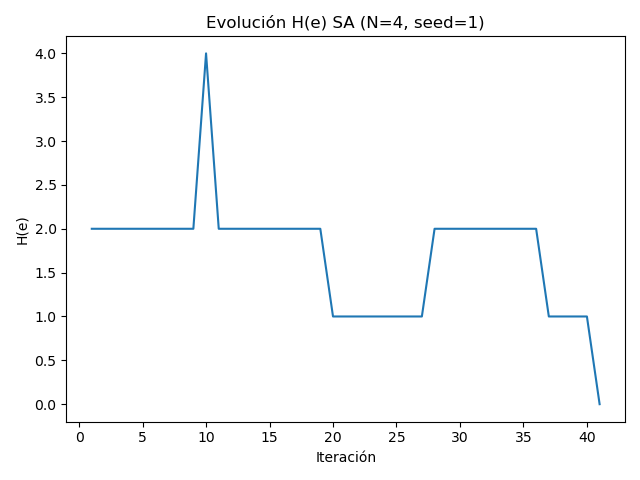
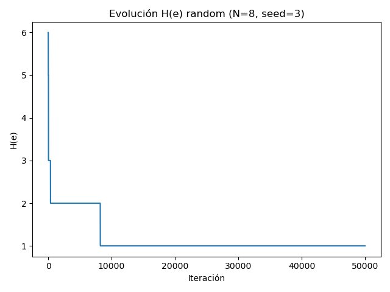
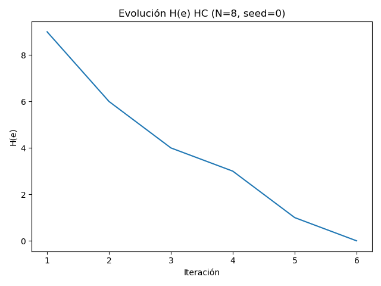
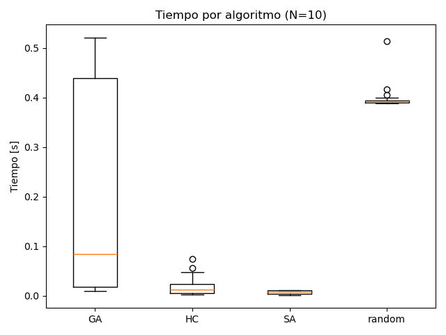
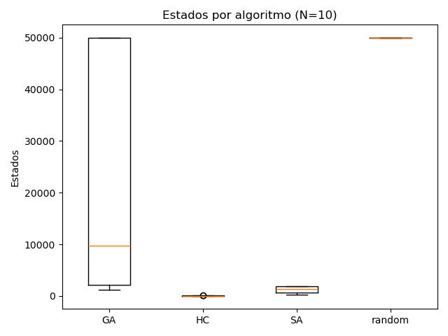
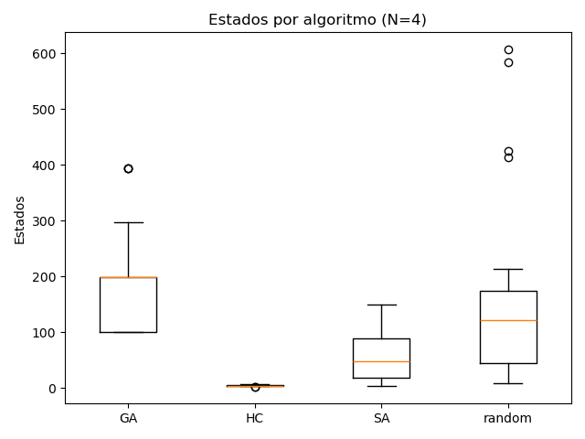
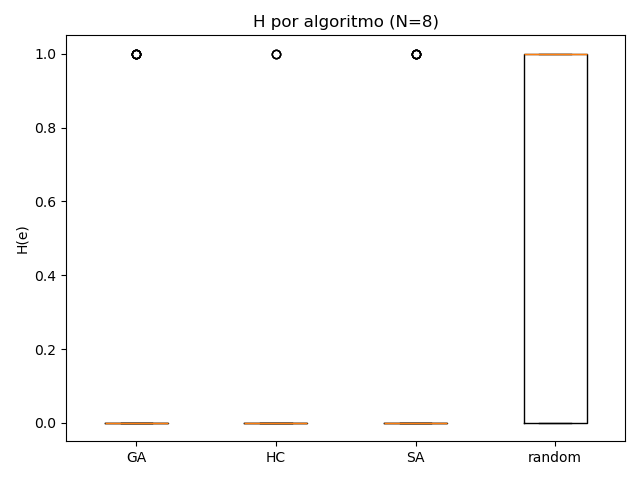
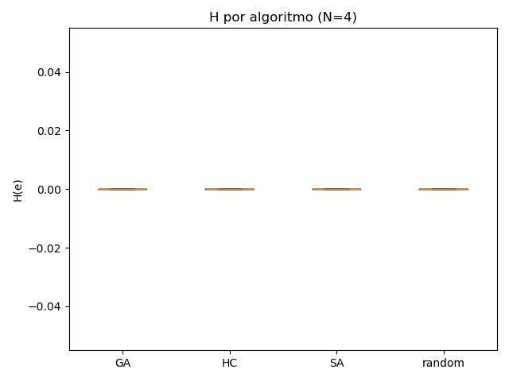

## Atp4 – Evaluación de desempeño en N-reinas (Búsqueda local)

Resumen  
Este reporte compara cuatro enfoques para el problema de N-reinas: Hill Climbing (HC), Simulated Annealing (SA), Algoritmo Genético (GA) y Búsqueda Aleatoria (Random).  
Se realizaron 30 corridas para cada algoritmo y tamaño de tablero (N=4, 8, 10).  
Se reportan: tasa de éxito (H=0), H promedio y desviación estándar, tiempo promedio y desviación estándar, y estados promedio recorridos y su desviación.

---

1) Configuración del problema  
- Representación: arreglo de longitud N; índice = columna, valor = fila.  
- Función objetivo H(e): número de pares de reinas en conflicto.  
- Criterio de solución: H(e)=0.  
- Presupuesto: número máximo de estados iguales para todos los algoritmos.

---

2) Algoritmos  

2.1 Hill Climbing  
- Vecindad: mover cada reina de columna a otra fila y elegir el mejor vecino.  
- Terminación: H=0, no mejora o límite de estados.  

2.2 Simulated Annealing  
- Vecindad: mover una reina al azar.  
- Aceptación: si Δ≤0 se acepta, si no con probabilidad exp(−Δ/T).  
- Schedule: T ← T·α, con T0≈1.0–2.0, α≈0.995–0.997, Tmin≈1e−5.  
- Terminación: H=0, Tmin o límite.  

2.3 Algoritmo Genético  
- Individuo: tablero.  
- Fitness: −H(tablero).  
- Selección: torneo (k=3).  
- Crossover: uniforme por gen (pc≈0.9).  
- Mutación: pm≈0.1.  
- Reemplazo: elitismo.  
- Terminación: H=0 o límite.  

2.4 Random  
- Generar tableros al azar y quedarse con el mejor.  
- Terminar si H=0 o límite.  

---

3) Resultados cuantitativos (30 corridas, métricas desde tp4-Nreinas.csv)  

| Algoritmo | N | Éxito (%) | H medio | H std | Tiempo medio (s) | Tiempo std | Estados medios | Estados std |
|-----------|---|-----------|---------|-------|------------------|------------|----------------|-------------|
| GA        | 4 | 100.0     | 0.0000  | 0.0000| 0.0004           | 0.0004     | 181.7          | 96.6        |
| GA        | 8 | 76.7      | 0.2333  | 0.4302| 0.0942           | 0.1429     | 13585.7        | 20523.5     |
| GA        |10 | 63.3      | 0.3667  | 0.4901| 0.2170           | 0.2069     | 24345.3        | 23008.5     |
| HC        | 4 | 100.0     | 0.0000  | 0.0000| 0.0001           | 0.0000     | 4.1            | 1.0         |
| HC        | 8 | 90.0      | 0.1000  | 0.3051| 0.3093           | 1.6722     | 1688.8         | 9124.5      |
| HC        |10 | 100.0     | 0.0000  | 0.0000| 0.0167           | 0.0172     | 39.1           | 39.4        |
| SA        | 4 | 100.0     | 0.0000  | 0.0000| 0.0001           | 0.0001     | 54.9           | 41.7        |
| SA        | 8 | 80.0      | 0.2000  | 0.4068| 0.0035           | 0.0026     | 867.5          | 646.7       |
| SA        |10 | 56.7      | 0.4333  | 0.5040| 0.0073           | 0.0032     | 1278.3         | 574.9       |
| Random    | 4 | 100.0     | 0.0000  | 0.0000| 0.0004           | 0.0004     | 151.3          | 157.6       |
| Random    | 8 | 30.0      | 0.7000  | 0.4661| 0.2595           | 0.0627     | 44523.6        | 10741.3     |
| Random    |10 | 0.0       | 1.7333  | 0.4498| 0.3979           | 0.0227     | 50000.0        | 0.0         |

---

4) Resultados gráficos  

4.1 Evolución de H(e) en una corrida representativa  
- SA (N=4, seed=1):   
- Random (N=8, seed=3):   
- HC (N=8, seed=0):   
- GA (N=10, seed=2):   

4.2 Boxplots  
- Tiempo (N=10):   
- Estados (N=10):   
- Estados (N=4):   
- H (N=8):   
- H (N=4):   

---

5) Observaciones  
- N=4: todos logran éxito total con muy bajo costo.  
- N=8: HC, SA y GA logran alta tasa de éxito; Random solo 30%.  
- N=10: GA y SA todavía resuelven una parte, pero con menor éxito (63% y 57%). HC sorprende con 100% en estas corridas, aunque puede variar por semilla. Random falla completamente.  
- En costo, HC es el más rápido cuando encuentra un buen camino, SA mantiene equilibrio, GA es más pesado pero explora más, Random consume siempre todo el presupuesto.  

---

6) Conclusión  
- HC es muy eficiente y logra éxito alto hasta N=10, pero depende de la semilla.  
- SA es más robusto para escapar de mínimos locales, aunque no siempre alcanza éxito total.  
- GA puede resolver pero es costoso en tiempo/estados y sensible a hiperparámetros.  
- Random solo sirve como línea base, ineficiente a partir de N=8.  

El algoritmo más adecuado en este contexto es Hill Climbing para tamaños moderados (N≤10), mientras que SA es recomendable cuando aumenta la dificultad porque ofrece mayor robustez que HC.  
