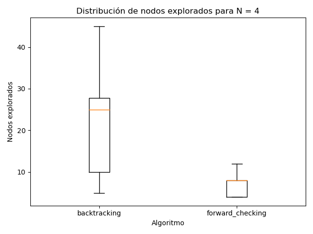
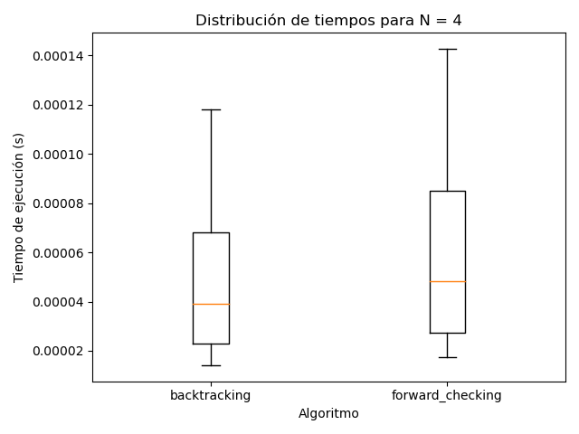
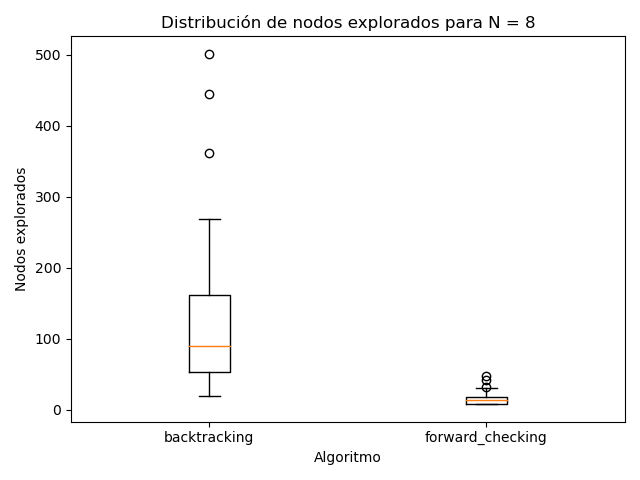
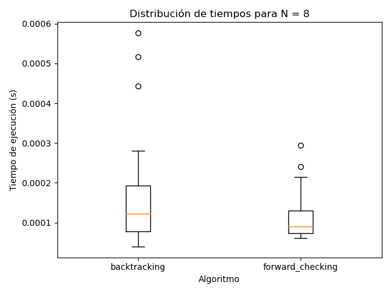
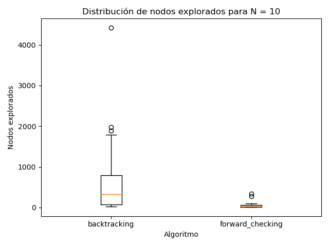
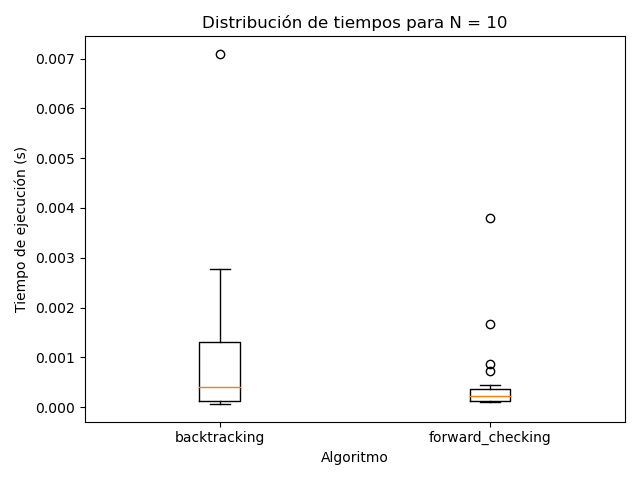

## ejercicio 1
Descripcion general: Un Sudoku clasico es una grilla de 9 por 9 dividida en 9 subcuadriculas de 3x3. Hay que completar las celdas con numeros de 1 a 9 y cada numero solo aparece una vez.
Variables:
Cada cedula de la 9x9 grilla es una varibale de integer. Entonces se definen 81 variables X_ij donde i,j elemento de {1,..,9}.

Domains:
El dominio de cada variable es el conjunto {1,2,...,9}. Si el Sudoku incluye cedulas preasignadas, el dominio de esa variable se restringe al valor dado.

Restricciones:

El problema incluye tres tipos principales de restricciones de desigualdad:
1. Restriccion por fila: todos los valores en una misma fila deben ser distintos
2. Restriccion por columna: todos los valores en una misma columna deben ser distintos.
3. Restriccion por subcuadro 3x3: cada bloque 3x3 debe contener valores distintos.

Solucion del CSP:
Una asignacion completa y consistente de valores a las variables que satisface todas las restricciones constituye una solucion valida del Sudoku.

## Ejercicio 2
WA = rojo, V = azul, entonces:
NT puede ser {azul, verde}
NSW puede ser {rojo, verde}
SA puede ser {verde} 
-> SA = verde, entonces:
NT puede ser {azu}
-> NT = azul, entonces:
NSW puede ser {rojo}
-> NSW = rojo, entonces:
Q puede ser {} -> inconsistencia!

### ejercicio 3
Un CSP estructurado como arbol es aquel en el que el grafo de restricciones no contiene ciclos: entre dos variables cualesquiera existe a lo sumo un unico camino. Este tipo de estructura simplifica el proceso de propagacion de restricciones.
El algoritmo AC-3 revisa todos los arcos del grafo y elimina valores incosistentes del dominio de los variables. Si se modifica un dominio, se vuelven a agregar a la cola todos los arcos relacionados con X_i para mantener la cosistencia. En el caso general con n variables, e arcos y dominios de tamano maximo d, la complejidad es O(e*d³). Cuando el grafo de restricciones forma un arbol cada variable esta conectada a un numero limitado de vecinos y cada arco se revisa una unica vez en cada direccion, ya que no se generan nuevas dependencias al propagar los cambios. Por lo tanto, la complejidad se reduce significativamente: O(n*d²).

### ejercicio 4 y 5

Se realizaron 30 ejecuciones por algoritmo (backtracking y forward checking) para N = 4, 8 y 10.  
En cada corrida se registraron el éxito de la búsqueda, el tiempo de ejecución y la cantidad de nodos explorados.

#### a) Resultados generales

Los resultados se almacenaron en el archivo `tp5-Nreinas.csv`, ubicado en la carpeta `tp5-csp`.  
Cada fila contiene: algoritmo, tamaño del problema (N), semilla, éxito (1/0), tiempo de ejecución (s) y nodos explorados.

#### b) Porcentaje de éxito y estadísticas

Ambos algoritmos encontraron soluciones válidas en el 100% de las ejecuciones.  
Las diferencias más relevantes se observaron en la cantidad de nodos y en la dispersión del tiempo de ejecución:

- **Backtracking**: número promedio de nodos considerablemente mayor, con fuerte variabilidad entre ejecuciones (outliers frecuentes).  
- **Forward checking**: reducción sustancial del espacio de búsqueda, menor varianza y tiempos más homogéneos.  
- El tiempo de ejecución se mantuvo bajo para todos los N, pero el crecimiento con N es más pronunciado para backtracking.

En resumen, **forward checking mejora la eficiencia sin comprometer la tasa de éxito**, confirmando su ventaja en CSPs con restricciones de consistencia fuerte.

#### c) Boxplots

Los gráficos muestran la distribución de tiempos y nodos para cada algoritmo y tamaño N.

**N = 4**  
  

**N = 8**  
  

**N = 10**  
  

#### d) Comparación con el TP4

En el TP4 el problema de las N reinas se abordó mediante algoritmos de búsqueda local (Hill Climbing, Simulated Annealing, algoritmo genético y búsqueda aleatoria), definidos sobre el espacio completo de configuraciones y guiados por la función H(e), que cuenta la cantidad de pares de reinas en conflicto.

Desde el punto de vista conceptual, las principales diferencias entre el enfoque del TP4 y el de este trabajo son:

- En el TP4 la búsqueda es local y típicamente estocástica: se generan vecindades de un estado actual y se avanza hacia configuraciones con mejor valor de H(e). Esto no garantiza llegar siempre a un estado solución óptimo en un número acotado de pasos.
- En este TP5 el problema se formula como un CSP, y los algoritmos de backtracking y forward checking realizan una búsqueda sistemática en el árbol de asignaciones. Si el problema es soluble y se dispone de recursos suficientes, estos algoritmos garantizan encontrar una solución.
- La medida usada en el TP4 (cantidad de estados explorados) y el número de nodos del TP5 no son idénticas, pero en ambos casos indican cuánto espacio de búsqueda se recorre. En los experimentos de este TP, el forward checking recorre consistentemente menos nodos que backtracking, lo que es coherente con el efecto de la propagación de restricciones.
- De forma cualitativa, puede verse la relación entre ambos trabajos: las metaheurísticas del TP4 reducen el número de estados explorados mediante heurísticas sobre la función H(e), mientras que en el TP5 la reducción se consigue imponiendo consistencia sobre las restricciones antes de expandir nuevos nodos.

En síntesis, los resultados de TP4 y TP5 muestran dos enfoques complementarios para el problema de las N reinas: por un lado, las metaheurísticas de búsqueda local permiten explorar espacios grandes de forma flexible sin garantías absolutas de optimalidad; por otro lado, la formulación como CSP, combinada con técnicas como forward checking, permite realizar una búsqueda exacta y controlada, en la que la propagación de restricciones mejora significativamente la eficiencia frente al backtracking simple.