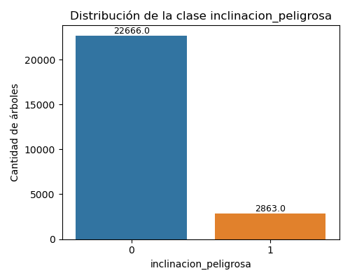

# Trabajo Práctico 7B – Parte I  
## Clasificadores básicos y evaluación de métricas

---

### 1. Clasificador Aleatorio

Se implementó un clasificador aleatorio que asigna una probabilidad uniforme entre 0 y 1 a cada registro y clasifica como "peligroso" cuando la probabilidad es mayor a 0.5.

La función utilizada fue `random_classifier()`, y la evaluación sobre el conjunto de validación se realizó con `evaluar_random_classifier()`.

#### Matriz de confusión

|               | Pred. No Peligroso (0) | Pred. Peligroso (1) |
|----------------|------------------------|----------------------|
| **Real No Peligroso (0)** | TN = 2883 | FP = 2784 |
| **Real Peligroso (1)**    | FN = 370  | TP = 346  |

#### Métricas del modelo

| Métrica       | Valor  |
|----------------|--------|
| Accuracy       | 0.5059 |
| Precision      | 0.1105 |
| Sensitivity (TPR) | 0.4832 |
| Specificity (TNR) | 0.5087 |

El clasificador aleatorio presenta valores cercanos a los esperados para un modelo al azar, con una Accuracy próxima al 50% y un AUC teórico aproximado de 0.5.  
Este resultado sirve como **baseline inferior** para comparar modelos posteriores.

---

### 2. Clasificador por Clase Mayoritaria

Se implementó un segundo clasificador (`biggerclass_classifier()`) que asigna a todos los registros la clase más frecuente en el conjunto de entrenamiento, en este caso **clase 0 (no peligroso)**.

#### Matriz de confusión

|               | Pred. No Peligroso (0) | Pred. Peligroso (1) |
|----------------|------------------------|----------------------|
| **Real No Peligroso (0)** | TN = 5667 | FP = 0 |
| **Real Peligroso (1)**    | FN = 716  | TP = 0 |

#### Métricas del modelo

| Métrica       | Valor  |
|----------------|--------|
| Accuracy       | 0.8878 |
| Precision      | – (no positivos predichos) |
| Sensitivity (TPR) | 0.0 |
| Specificity (TNR) | 1.0 |

Este modelo alcanza una **Accuracy alta (88.8%)**, pero no detecta ningún árbol peligroso (Sensitivity = 0).  
Demuestra cómo una métrica global puede ser engañosa en presencia de **clases desbalanceadas**, motivo por el cual se utilizará **AUC ROC** como métrica principal en el desafío de Kaggle.

---

### 3. Conclusión

- El clasificador aleatorio ofrece un punto de partida neutro con desempeño cercano al azar.  
- El clasificador por clase mayoritaria, aunque muestra una Accuracy elevada, **falla completamente en identificar los árboles peligrosos**, evidenciando la necesidad de métricas más robustas.  
- En los ejercicios siguientes se aplicará validación cruzada y modelos de decisión para mejorar la detección de la clase minoritaria.
