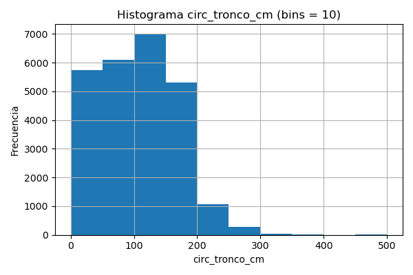

# Trabajo Práctico 7B – Parte I  
## Análisis Exploratorio de Datos (EDA)

---

### 1. Distribución de la variable `inclinacion_peligrosa`

La mayoría de los registros corresponden a árboles **sin inclinación peligrosa (clase 0)**, lo que confirma un fuerte **desbalance de clases**.  
Esto es importante a considerar al momento de entrenar clasificadores.

---

### 2. Secciones con mayor proporción de inclinación peligrosa

Se calculó la **proporción de árboles peligrosos por sección**, considerando únicamente secciones con al menos 50 muestras.  
Algunas secciones presentan una mayor tasa de inclinaciones peligrosas, lo que podría relacionarse con factores ambientales o condiciones del terreno.

---

### 3. Especies con mayor proporción de inclinación peligrosa

Se estimó la proporción de árboles con inclinación peligrosa por **especie** (mínimo 30 observaciones).  
Las especies ubicadas en el top del gráfico presentan un mayor riesgo estructural, posiblemente asociado al tamaño o la morfología de sus raíces.

---

### 4. Histogramas de la variable `circ_tronco_cm`

Se generaron histogramas de la variable `circ_tronco_cm` con diferentes números de bins para observar su distribución.  
La variable presenta una **asimetría hacia la derecha**, con muchos árboles de circunferencia pequeña y pocos ejemplares muy grandes.

  
  

---

### 5. Histograma de `circ_tronco_cm` por clase de inclinación peligrosa

Separando por la clase `inclinacion_peligrosa`, se observa que los árboles más gruesos tienden a presentar una inclinación más peligrosa, aunque existe solapamiento entre las clases.

---

### 6. Variable categórica `circ_tronco_cm_cat`

A partir de los cuartiles de la variable `circ_tronco_cm`, se definieron cuatro categorías:  

| Categoría  | Rango (en cm) aproximado | Descripción |
|-------------|--------------------------|--------------|
| bajo        | menor al cuartil 25      | Árbol delgado |
| medio       | entre cuartiles 25–50    | Árbol de circunferencia media |
| alto        | entre cuartiles 50–75    | Árbol grueso |
| muy alto    | mayor al cuartil 75      | Árbol de gran circunferencia |

Esta nueva variable fue guardada en el archivo:  
`tp7-ml/data/arbolado-mendoza-dataset-circ_tronco_cm-train.csv`

---

### 7. Conclusiones del EDA

- El dataset presenta **clases desbalanceadas**, predominando árboles sin inclinación peligrosa.  
- Existen **secciones y especies** con mayor proporción de árboles inclinados.  
- La variable `circ_tronco_cm` muestra una distribución sesgada, por lo que su discretización en categorías facilita el análisis posterior.  
- Estas observaciones servirán para ajustar los clasificadores y definir estrategias de muestreo o ponderación de clases.
